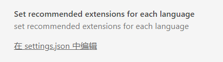

# language-recommend-extension README

Do you feel annoyed by frequently opening and closing plugins when using vscode? This plug-in provides a way to set up. When you set the open extension for a language, press `ctrl`+`shitf`+`P` in the editor to open the command panel, and select the "**get recommended extensions for current language**" command to enter the plug-in interface. Find the desired plug-in among many plug-ins 

在使用vscode时是否因为频繁开启和关闭插件感到烦躁？本插件提供一个设置的途径，当你对某个语言设置了开启的拓展，在编辑器中按`ctrl`+`shitf`+`p`打开命令面板，选择“**get recommended extensions for current language**”命令，就会进入插件界面，不用在很多插件中寻找想要的插件

## Features


Search for "set recommended extensions for each language" in the search box, click Edit in json, and edit the plug-in you want to associate. 
在搜索框搜索"set recommended extensions for each language",点击在json中编辑,编辑想要关联的插件.

插件的格式如图，
```json
"language":[
    "extension id"
]
```
The plug-in id is the part marked in the red box 
插件id为红框标注的部分

例子：


After setting, press `ctrl`+`shitf`+`p` in the editor to open the command panel, and select the "**get recommended extensions for current language**" command, 
设置完后，在编辑器中按`ctrl`+`shitf`+`p`打开命令面板，选择“**get recommended extensions for current language**”命令，


## Release Notes

Users appreciate release notes as you update your extension.

### 1.0.0

base function


-----------------------------------------------------------------------------------------------------------
